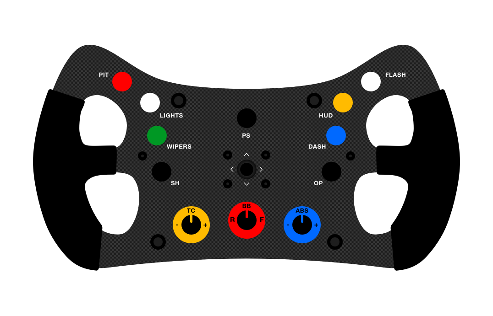
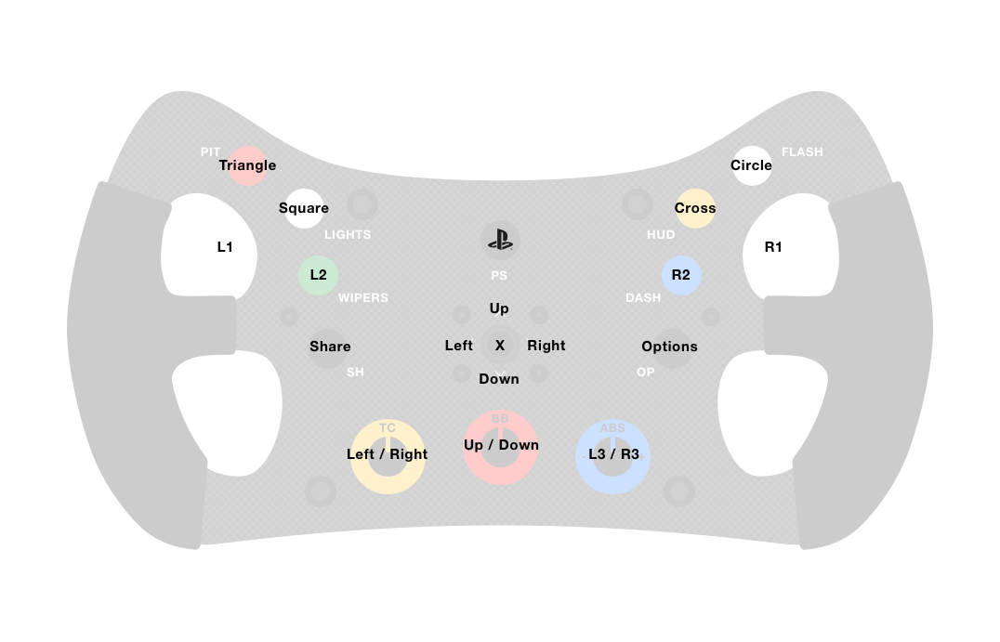

## Thrustmaster T300 F1 Wheel Arduino Nano Emulator

I'm trying to put together an Arduino Nano F1 wheel emulator. I found plenty of scripts that do some of the things I need, but none that do everything. 

#### What I want to achieve

I want to build a custom steering wheel for my Thrustmaster T300 base, that has a more ergonomic design and also features ALL the buttons available on the PS4 Pro Controller. 

##### What is the problem with the current projects?

The best project I've found so far only supports the standard wheel which is missing the L3 & R3 buttons. Thise buttons are on the base itself. Another script includes these buttons but is way complex and lacks any documentaion, so using it is impravtival. Another problem is the fact that the Nano only has 16 GPIO but with the addition of the L3 & R3, we need 18.

#### Solution?

I'm going to build a button grid 5x4 matrix which only require 9 GPIO, and can provide 20 buttons.

I may also (at some point) include a screen for displaying various feedbavk on the switches.

#### Target build

The idea is to get a custom built steering wheel form 3drap and add:

* 11x Buttons
* 3x Encoders
* 1x 5way Joystick

###### Design

###### PS4 Button Mapping

#### Credits to those who have helped in one way or another

* Taras Ivaniukovich, https://rr-m.org/blog/
* Danny van den Brande, Arduinosensors.nl
* Bram Harmsen, https://www.thingiverse.com/thing:2813599

