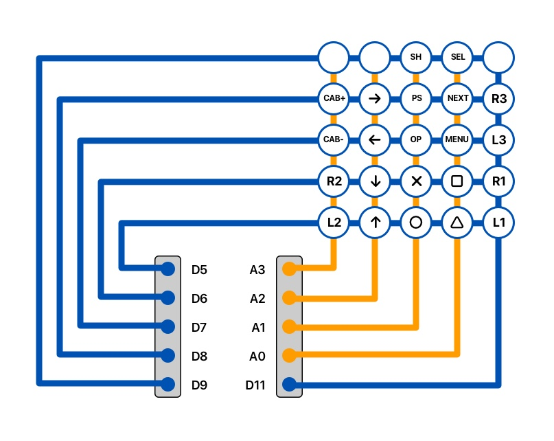

# The Board

The below is a representation of the final board design. Don't forget to visit [Tara's blog post](http://rr-m.org/blog/thrustmaster-t300rs-steering-wheel-arduino-emulator/) for more details on how to connect the Arduino Nano to the T300 base.

##### Notes:
1. I ended up soldering the RTC package onto the main board to save space
2. Everything was connected using Dupont angled male headers to reduce the height
3. The Arduino Nano was also placed on female pin connectors

## Board Diagram
 

## Rotary Switches

## I2C Serial Bus

## Shifters

## Extras

 

## Button Matrix

## Final Board (v1 & v2)
Both of these boards worked perfectly fine, but the v2 had a much slimmer profile which made it easier to fit in the enclosure. The RTC is not pictured on v2 as I had not yet (at the time) decided to hardwire it onto the board.

