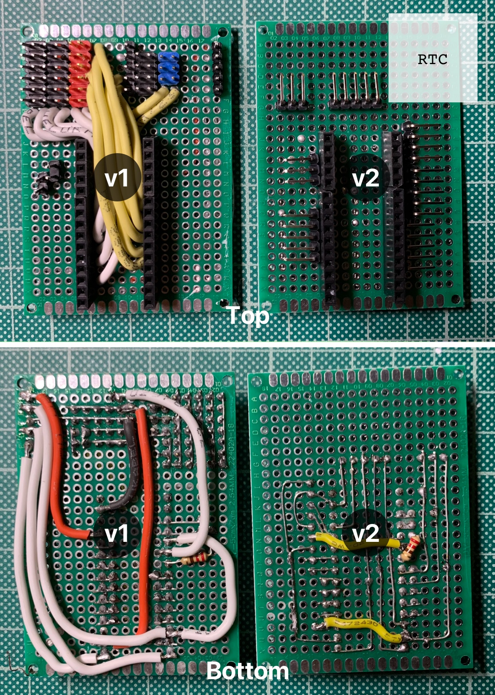

# The Board

The below is a representation of the final board design. Don;t forget to visit [Tara's blog post](http://rr-m.org/blog/thrustmaster-t300rs-steering-wheel-arduino-emulator/) for more details on how to connect the Arduno to the base.

##### Notes:
1. I ended up soldering the RTC package onto the main board to save space
2. Everything was connected using DuPont angled male headers to reduce the height
3. The Arduino was also placed on female pin connectors

## Board Diagram

## Final Board (v1 & v2)
The RTC is not pictured on v2 as I had not yet (at the time) decided to hardwire it onto the board.

