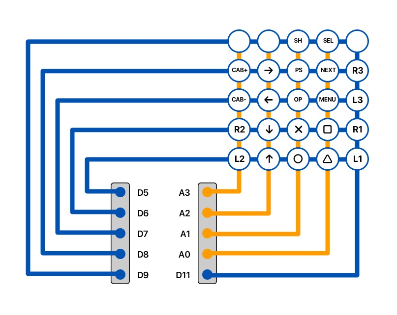

# Button Matrix

I've used a [Cantor Pairing Function](https://en.wikipedia.org/wiki/Pairing_function#Cantor_pairing_function) to create unique numbers for each button matrix cell. These numbers are then converted to actions using a case switch in the main sketch file.

|          | **Cols** | **0**        | **1**       | **2**       | **3**       | **4**   |
| -------- | -------- | ------------ | ----------- | ----------- | ----------- | ------- |
| **Rows** | **Pins** | **14** (A0)  | **15** (A1) | **16** (A2) | **17** (A3) | **D11** |
| **0**    | **D5**   | 204 Triangle | 225 Circle  | 247 Up      | 270 L2      | 147 L1  |
| **1**    | **D6**   | 224 Square   | 246 Cross   | 269 Down    | 293 R2      | 164 R1  |
| **2**    | **D7**   | 245 Menu     | 268 Options | 292 Left    | 317 CAB-    | 182 L3  |
| **3**    | **D8**   | 267 Next     | 291 PS      | 316 Right   | 342 CAB+    | 201 R3  |
| **4**    | **D9**   | 290 Select   | 315 Share   | 341 -       | 386 -       | 221 -   | 

## Button Matrix Diagram
