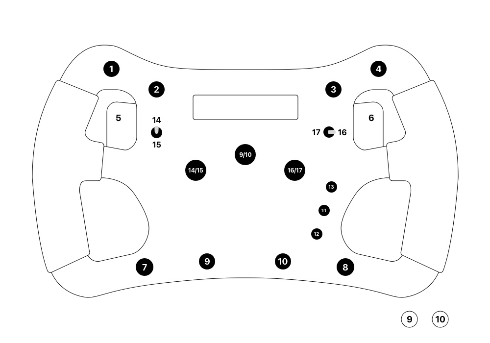
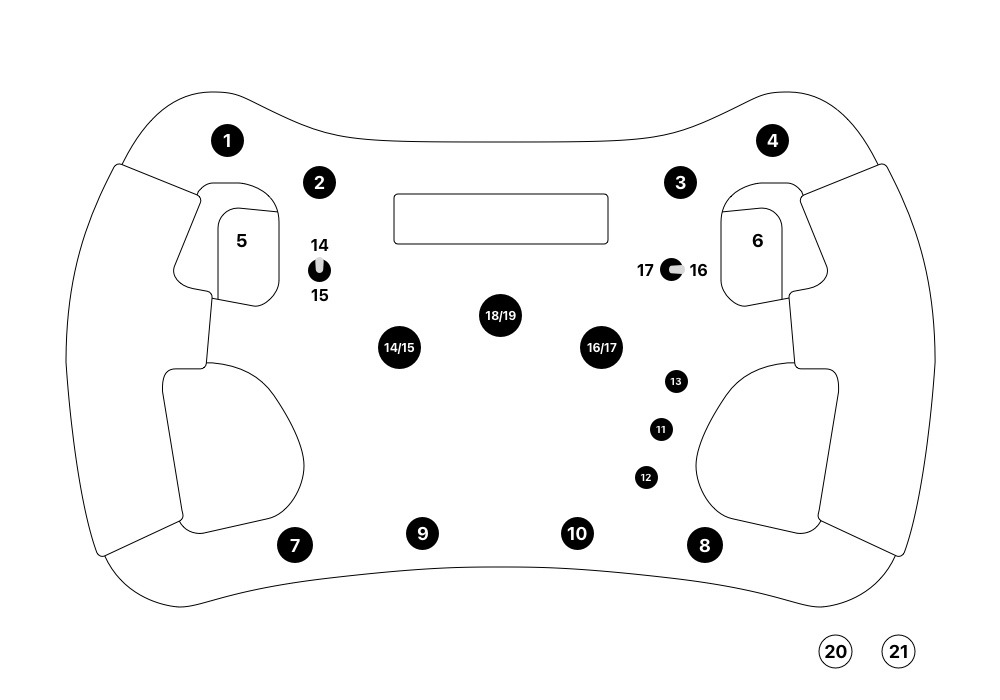

# Wheel Control Bindings

Here are all the wheel control bindings and how they map to each platform, **PlayStation & PC**.

I've also included how I've mapped them in **Assetto Corsa Competizione**, but obviosuly, this can be changed to your own liking. 

You can switch between these two modes on the wheel (Menu > Wheel Mode > PS or PC)

## PlayStation (PS) Mode

| Wheel  | PlayStation | Assetto Corsa Competizione |
| -------| ----------- | -------------------------- |
| **1**  | Triangle    | Pit Limiter                |
| **2**  | Square      | Next Dash Page             |
| **3**  | Cross       | Cycle HUD MFD Up           |
| **4**  | Circle      | Flasher                    |
| **5**  | L1          | Shift Down                 |
| **6**  | R1          | Shift Up                   |
| **7**  | L2          | Cycle Wiper                |
| **8**  | R2          | Cycle Light Stages         |
| **9**  | L3          | Decrease ABS               |
| **10** | R3          | Increase ABS               |
| **11** | PlayStation | -                          |
| **12** | Share       | -                          |
| **13** | Options     | -                          |
| **14** | D-Pad Up    | Decrease Brake Bias        |
| **15** | D-Pad Down  | Increase Brake Bias        |
| **16** | D-Pad Right | Decrease Traction Control  |
| **17** | D-Pad Left  | Increase Traction Control  |

## Advanced (PC) Mode

| Wheel  | PC                 | Assetto Corsa Competizione | In Game Menu |
| -------| ------------------ | -------------------------- | ------------ |
| **1**  | 3                  | Pit Limiter                |              |
| **2**  | 4                  | Next Dash Page             |              |
| **3**  | 6                  | Cycle HUD MFD Up           | Confirm      |
| **4**  | 5                  | Flasher                    | Back         |
| **5**  | 1                  | Shift Down                 |              |
| **6**  | 2                  | Shift Up                   |              |
| **7**  | 10                 | Cycle Wiper                |              |
| **8**  | 9                  | Cycle Light Stages         |              |
| **9**  | 11                 | Start                      |              |
| **10** | 12                 | Ignition                   |              |
| **11** | 13                 | -                          |              |
| **12** | 7                  | -                          |              |
| **13** | 8                  | -                          | ESC          |
| **14** | D-Pad Up           | Decrease Brake Bias        | Up           |
| **15** | D-Pad Down         | Increase Brake Bias        | Down         |
| **16** | D-Pad Right        | Decrease Traction Control  | Right        |
| **17** | D-Pad Left         | Increase Traction Control  | Left         |
| **18** | 20                 | Decrease ABS               |              |
| **19** | 21                 | Increase ABS               |              |
| **20** | 24		             | -                          |              |
| **21** | 25		             | Camera View                |              |

